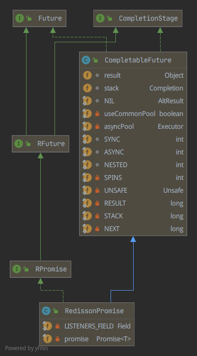

# Redisson组件分析

## Future模式

工作流程图参考：**graph/redisson-pubsub.drawio/Redisson-Future模式**

Redisson RPromise 整合了Netty  DefaultPromise 和 JDK CompletableFuture的实现，它继承了CompletableFuture, 同时又包含DefaultPromise的对象引用字段。

