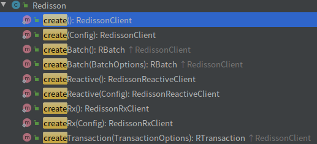
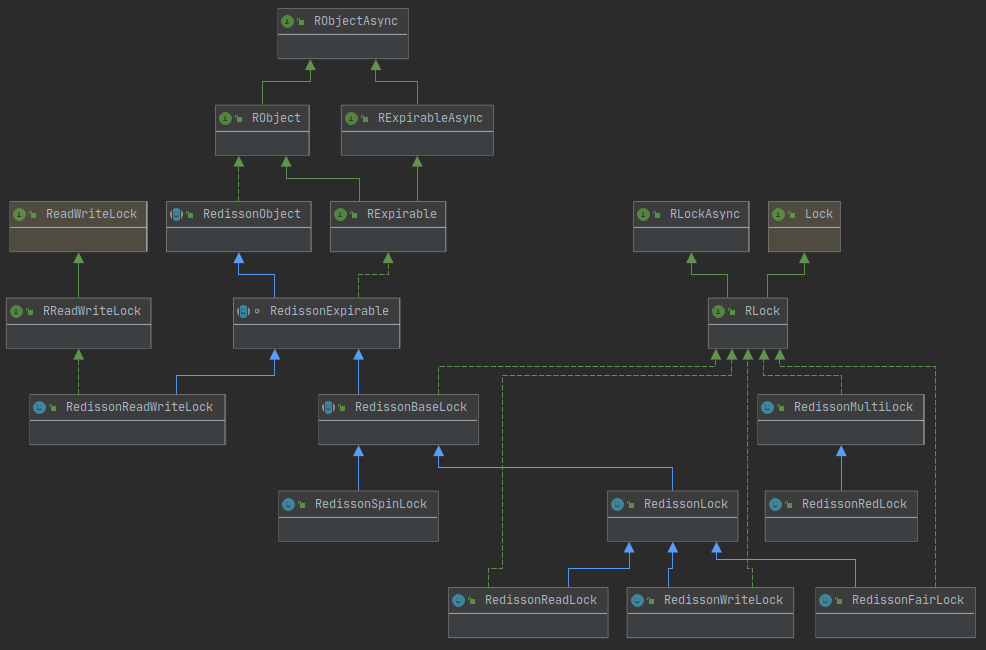
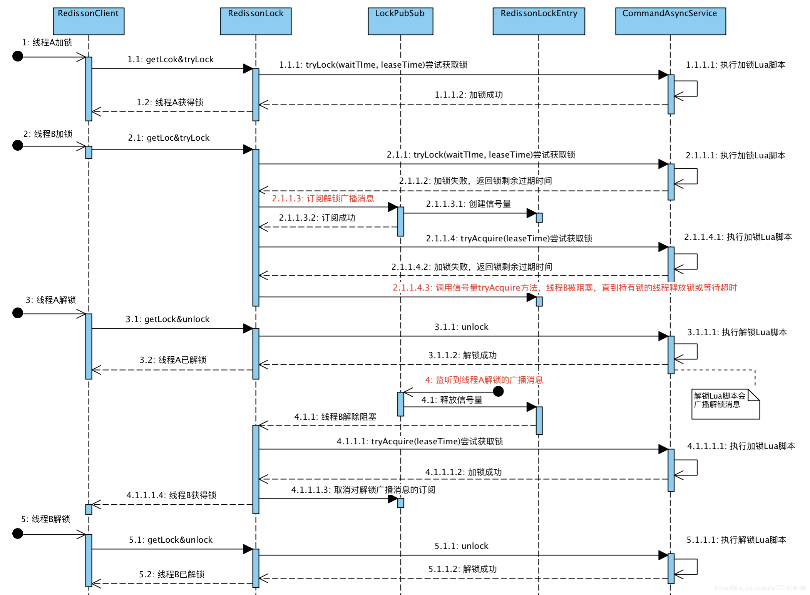

# Redisson分布式锁实现原理

[官方中文文档]([https://github.com/redisson/redisson/wiki/%E7%9B%AE%E5%BD%95](https://github.com/redisson/redisson/wiki/目录))

最早接触`Redisson`是用到其分布式锁功能，但是`Redisson`并不是只提供分布式锁功能，分布式锁只是其中一个功能，它的定位是一个具有分布式特性的工具集。

而且`Redission`分开源版本和Pro版本(付费版本，提供了更多功能)。

**[Table of Content](https://github.com/redisson/redisson/wiki/Table-of-Content)** | [目录](https://github.com/redisson/redisson/wiki/目录)

1. **[Overview](https://github.com/redisson/redisson/wiki/1.-Overview)**
   [概述](https://github.com/redisson/redisson/wiki/1.-概述)
2. **[Configuration](https://github.com/redisson/redisson/wiki/2.-Configuration)**
   [配置方法](https://github.com/redisson/redisson/wiki/2.-配置方法)
3. **[Operations execution](https://github.com/redisson/redisson/wiki/3.-operations-execution)**
   [程序接口调用方式](https://github.com/redisson/redisson/wiki/3.-程序接口调用方式)
4. **[Data serialization](https://github.com/redisson/redisson/wiki/4.-data-serialization)**
   [数据序列化](https://github.com/redisson/redisson/wiki/4.-数据序列化)
5. **[Data partitioning (sharding)](https://github.com/redisson/redisson/wiki/5.-data-partitioning-(sharding))**
   [单个集合数据分片（Sharding）](https://github.com/redisson/redisson/wiki/5.-单个集合数据分片（Sharding）)
6. **[Distributed objects](https://github.com/redisson/redisson/wiki/6.-distributed-objects)**
   [分布式对象](https://github.com/redisson/redisson/wiki/6.-分布式对象)
7. **[Distributed collections](https://github.com/redisson/redisson/wiki/7.-distributed-collections)**
   [分布式集合](https://github.com/redisson/redisson/wiki/7.-分布式集合)
8. **[Distributed locks and synchronizers](https://github.com/redisson/redisson/wiki/8.-distributed-locks-and-synchronizers)**
   [分布式锁和同步器](https://github.com/redisson/redisson/wiki/8.-分布式锁和同步器)
9. **[Distributed services](https://github.com/redisson/redisson/wiki/9.-distributed-services)**
   [分布式服务](https://github.com/redisson/redisson/wiki/9.-分布式服务)
10. **[Additional features](https://github.com/redisson/redisson/wiki/10.-additional-features)**
    [额外功能](https://github.com/redisson/redisson/wiki/10.-额外功能)
11. **[Redis commands mapping](https://github.com/redisson/redisson/wiki/11.-Redis-commands-mapping)**
    [Redis命令和Redisson对象匹配列表](https://github.com/redisson/redisson/wiki/11.-Redis命令和Redisson对象匹配列表)
12. **[Standalone node](https://github.com/redisson/redisson/wiki/12.-Standalone-node)**
    [独立节点模式](https://github.com/redisson/redisson/wiki/12.-独立节点模式)
13. **[Tools](https://github.com/redisson/redisson/wiki/13.-Tools)**
    [工具](https://github.com/redisson/redisson/wiki/13.-工具)
14. **[Integration with frameworks](https://github.com/redisson/redisson/wiki/14.-Integration-with-frameworks)**
    [第三方框架整合](https://github.com/redisson/redisson/wiki/14.-第三方框架整合)
15. **[Dependency list](https://github.com/redisson/redisson/wiki/15.-Dependency-list)**
    [项目依赖列表](https://github.com/redisson/redisson/wiki/15.-项目依赖列表)
16. **[FAQ](https://github.com/redisson/redisson/wiki/16.-FAQ)**

这里只分析分布式锁那部分的实现。

## `Redission` 网络通信原理

也可以学习下`Redission`是怎么使用`Netty`的。

+ **源码分析准备工作**

  执行单元测试`RedissionLockTest`，第一步是启动`redis-server`, 通过静态代码块或静态方法做了一些初始化工作(指定`redis-server`执行路径，随机生成一个`/tmp/`下的临时目录，随机分配空闲的端口)。

  ```java
  // 修改运行时环境，单元测试默认环境是window，我这里是Linux
  public static final String redisBinaryPath = System.getProperty("redisBinary", "/opt/redis/bin/redis-server");
  // 拼接出来的启动命令 
  // REDIS LAUNCH OPTIONS: [/opt/redis/bin/redis-server, --dir, /tmp/bd653318-f147-4dac-b270-09fae6e56801, --port, 43873]
  // 然后使用 jdk ProcessBuilder 启动 redis-server
  ```

  可以看到第二个就是单元测试启动的(`RedisProcess`实例)。

  ```
  root     10285  0.1  0.0  64328  3764 pts/1    Sl+  2月23   4:20 bin/redis-server 127.0.0.1:6379
  lee      19956  0.1  0.0  64328  5112 ?        Sl   17:00   0:00 /opt/redis/bin/redis-server *:43873
  ```

  第二步是创建并启动`redis-cli`，获取启动的`redis-server`的地址和端口等配置。然后创建`Redisson`实例（就是客户端实例）。

  ```java
  config = new Config();
  config.useSingleServer().setAddress("redis://127.0.0.1:6379");
  redisson = Redisson.create(config);
  ```

+ **`Redisson`客户端连接**

  参考：[程序接口调用方式](https://github.com/redisson/redisson/wiki/3.-程序接口调用方式)

  客户端创建时有多种类型：

  

  `RedissonClient`、`RedissonReactiveClient`和`RedissonRxClient`实例本身和`Redisson`提供的所有分布式对象都是线程安全的。

  现在仅关注`RedissionClient`。

  客户端接口定义`RedissionClient`方法非常多, 大部分都是`Redission`提供的功能接口。

  客户端实现类`Redission implements RedissonClient`，下面是主要的数据结构。

  ```java
  protected final QueueTransferService queueTransferService = new QueueTransferService();
  protected final EvictionScheduler evictionScheduler;
  protected final WriteBehindService writeBehindService;
  protected final ConnectionManager connectionManager;
  
  protected final ConcurrentMap<Class<?>, Class<?>> liveObjectClassCache = new ConcurrentHashMap<>();
  //连接配置，如IP, Port, 密码, db,主从,哨兵, 集群等配置 ...
  protected final Config config;
  protected final ConcurrentMap<String, ResponseEntry> responses = new ConcurrentHashMap<>();
  ```

  创建连接

  ```java
  public static RedissonClient create(Config config) {
      // 通过config创建连接管理器ConnectionManager, 再创建EvictionScheduler，WriteBehindService
      // TODO 这三个是什么东西, 后面说
      Redisson redisson = new Redisson(config);
  	// 中间省略启用redission referece 功能 ? 额外注册了一个ReferenceCodec的编码器, 估计类似AtomicReference，给原本的客户端拓展些功能？TODO
      ...
      return redisson;
  }
  ```

  

  + `SingleConnectionManager`

    + `MasterSlaveConnectionManager`

      内部通过`NETTY` `EPOLL`模型创建了线程池。为什么要引入线程池呢？看后面的众多`Async`接口就明白了：我就算只有一个连接但是也是可能需要执行多任务的。关于`Netty` `EPOLL`参考对应仓库。

      对应地建立了管理线程池`EpollEventLoopGroup`和工作线程池。

      ```java
    this.group = new EpollEventLoopGroup(cfg.getNettyThreads(), new DefaultThreadFactory("redisson-netty"));
      this.resolverGroup = cfg.getAddressResolverGroupFactory().create(EpollDatagramChannel.class, DnsServerAddressStreamProviders.platformDefault());
    
      executor = Executors.newFixedThreadPool(threads, new DefaultThreadFactory("redisson"));
      
       this.commandExecutor = new CommandSyncService(this);
       
       initTimer(cfg);
      		timer = new HashedWheelTimer(new DefaultThreadFactory("redisson-timer"), minTimeout, TimeUnit.MILLISECONDS, 1024, false);
              connectionWatcher = new IdleConnectionWatcher(this, config);
              subscribeService = new PublishSubscribeService(this, config);
       initSingleEntry();
      ```

+ **命令执行流程**

  之前看锁的源码想要找`Redisson`怎么执行命令的，结果代码太多，浏览过程中寻找失败。然后去查单元测试代码。在`RedisClientTest.java`中发现这么一行代码。

  ```java
  // 这个单元测试是通过下面过程提交命令的。发现是发给Channel了（恍然，是啊，都引入Netty NIO模型了，Redisson肯定是要通过Channel，发给redis-cli再交给redis-server执行的啊）。
  conn.async(StringCodec.INSTANCE, RedisCommands.INCR, "test");
  	async(-1, encoder, command, params);
  		ChannelFuture writeFuture = send(new CommandData<T, R>(promise, encoder, command, params));
  			return channel.writeAndFlush(data);
  ```

  然后查看`send()`的反调用链，好像一切都变的清晰了

  ```java
  // 通过NioSocketChannel传递给工作者线程处理
  RedisConnection.send(CommandData<T, R>)  (org.redisson.client)
  	RedisConnection.sync(Codec, RedisCommand<T>, Object...)  (org.redisson.client)
  	ConnectionWatchdog.reattachBlockingQueue(RedisConnection, CommandData<?, ?>)  (org.redisson.client.handler)
      //
  	RedisExecutor.sendCommand(RPromise<R>, RedisConnection)  (org.redisson.command)
      	// 获取连接，成功之后调用sendCommand()
  		RedisExecutor.execute()  (org.redisson.command)
              Anonymous in scheduleResponseTimeout() in RedisExecutor.run(Timeout)  (org.redisson.command)
              RedisQueuedBatchExecutor.execute()  (org.redisson.command)
              CommandAsyncService.evalAsync(NodeSource, boolean, Codec, RedisCommand<T>, String, List<Object>, Object...)  (org.redisson.command)
              CommandBatchService.async(boolean, NodeSource, Codec, RedisCommand<V>, Object[], RPromise<R>, boolean)(2 usages)  (org.redisson.command)
              RedisExecutor.checkAttemptPromise(RPromise<R>, RFuture<RedisConnection>)(2 usages)  (org.redisson.command)
      	    // 注意这个接口方法，后面分析分布式锁时会经过这里
              CommandBatchService.executeAsync()  (org.redisson.command)
      		// 注意这个接口方法，后面分析分布式锁时会经过这里
              CommandAsyncService.async(boolean, NodeSource, Codec, RedisCommand<V>, Object[], RPromise<R>, boolean)  (org.redisson.command)
              Anonymous in scheduleRetryTimeout() in RedisExecutor.run(Timeout)  (org.redisson.command)
              Anonymous in checkAttemptPromise() in RedisExecutor.run(Timeout)  (org.redisson.command)
  RedisConnection.async(long, Codec, RedisCommand<T>, Object...)  (org.redisson.client)
  MasterSlaveEntry.reattachBlockingQueue(CommandData<?, ?>)  (org.redisson.connection)
  ```

  锁实现提交命令核心代码

  ```java
  protected <T> RFuture<T> evalWriteAsync(String key, Codec codec, RedisCommand<T> evalCommandType, String script, List<Object> keys, Object... params) {
      CommandBatchService executorService = createCommandBatchService();
      // 只是提交命令到队列中
      RFuture<T> result = executorService.evalWriteAsync(key, codec, evalCommandType, script, keys, params);
      if (commandExecutor instanceof CommandBatchService) {
          return result;
      }
  
      RPromise<T> r = new RedissonPromise<>();
      // 将命令最终通过RedisConnection经NioSocketChannel通过客户端发送出去。
      RFuture<BatchResult<?>> future = executorService.executeAsync();
      future.onComplete((res, ex) -> {
          if (ex != null) {
              r.tryFailure(ex);
              return;
          }
          r.trySuccess(result.getNow());
      });
      return r;
  }
  ```

  

****

## `Redisson`分布式锁和同步器

文档是上面第８章节。

分布式锁接口实现`java.util.concurrent.locks.Lock`接口。

`Redisson`几种分布式锁



+ **可重入锁（`ReentrantLock`）**

  **类**:`RedissonLock`, 源码单元测试类：`RedissionLockTest`。

  + `RLock`

    继承`JUC` `Lock`接口以及`RLockAsync`拓展的异步接口，拓展了可以自动释放锁的接口。

  + `RExpirable(I)`

    + `RObject`
    + `RObjectAsync`
    + `RExpirableAsync`

    集成`RObject`以及`RExpireableAsync`接口，拓展了生存周期（过期时间）相关的控制接口。

  + `CommandSyncService(C)`
    
    + `CommandAsyncService(C)`
    + `CommandExecutor (I, 客户端命令执行器)`
+ `LockPubSub`
  
**加锁流程**：
  

  
上图没有解释命令执行流程。
  
１）通过锁名(`key`名)计算出`Redis`槽点，进而获取所在`Redis`服务实例（这一步对多`Redis`节点才有用，单节点只有一个）。
  
  ２）创建批处理操作服务(用于将操作同步到从库), 然后创建`CommandBatchService`（示例中创建的是`CommandSyncService`）。
  
  ​		负责执行`Redis`命令`RedisCommand`(示例中创建的是`RedisStrictCommand`实例)。
  
  ​		执行器`RedisBatchExecutor`，执行器execute()方法并不负责直接与`redis`服务端联系执行命令。只是给entry(某个`Redis Node`实例)的`LinkedBlockingDeque`中加入待执行命令，就像Java线程池一样，submit等方法只是给线程池任务队列中添加任务。
  
  ３）通过`CommandBatchService`异步写`EVAL`命令(Future Promise channel写)。
  
  ```java
  // 加锁逻辑就是函数中这段Lua代码
  // 因为Redis lua 脚本执行具有原子性，不需要担心下面使用了三个命令执行加锁操作会被打断
  <T> RFuture<T> tryLockInnerAsync(long waitTime, long leaseTime, TimeUnit unit, long threadId, RedisStrictCommand<T> command) {
          internalLockLeaseTime = unit.toMillis(leaseTime);
          return evalWriteAsync(getName(), 
                                LongCodec.INSTANCE, 
                                command,
                                // 锁(key=lockName)不存在则添加，Hash key(lockName)  itemKey(threadId)加一并设置锁超时自动释放时间，返回nil
                                "if (redis.call('exists', KEYS[1]) == 0) then " +
                                        "redis.call('hincrby', KEYS[1], ARGV[2], 1); " +
                                        "redis.call('pexpire', KEYS[1], ARGV[1]); " +
                                        "return nil; " +
                                "end; " +
                                // 锁已经存在，则判断占有锁的是不是当前线程，是当前线程则重入计数加１，并重新设置超时时间, 返回nil
                                "if (redis.call('hexists', KEYS[1], ARGV[2]) == 1) then " +
                                        "redis.call('hincrby', KEYS[1], ARGV[2], 1); " +
                                        "redis.call('pexpire', KEYS[1], ARGV[1]); " +
                                       "return nil; " +
                                "end; " +
                                // 锁已存在并且被其他线程占用，则返回剩余超时时间
                                "return redis.call('pttl', KEYS[1]);",
                                // KEYS[1]
                                Collections.singletonList(getName()), 
                                // ARGV[1] 
                                internalLockLeaseTime, 
                                // ARGV[2]
                                getLockName(threadId));
  }
  ```
  
  ​		从上面可以看到`Redission`实现可重入锁完全是通过`Lua`脚本实现的。用到了`Hash`存储结构(使用`Hash`是为了实现可重入,记录重入次数)，先判断锁是否存在不存在则创建并设置重入计数为１并设置超时时间，已存在则判断是不是当前线程持有锁，若当前线程持有锁则重入计数加１，不是当前线程持有锁则返回剩余超时时间（TTL）。
  
  > 超时时间默认是30s
  
  ４）如果没有设置TTL时间就直接退出。有的话会同步等待超时之后执行释放。
  
  ```java
  // 锁释放的逻辑
  
  ```
  
  
  
+ **公平锁（`FairLock`）**

+ **联锁（`MultiLock`）**

+ **红锁（`RedLock`）**

+ **读写锁（`ReadWriteLock`）**

+ **信号量（`Semaphore`）**

+ **可过期性信号量（`PermitExpirableSemaphore`）**

+ **闭锁（`CountDownLatch`）**


## 附录

### 相关知识

+ `Netty NIO`

+ 响应式编程 `Reactive & Rx`

  反应式编程是一种涉及数据流和变化传播的异步编程范例。这意味着可以通过所采用的编程语言轻松地表达静态（例如阵列）或动态（例如事件发射器）数据流。

+ `Redission`的`RFuture`&`RPromise`

  是用于获取`Redis`异步执行的命令的结果的。示例中实现类是`RedissonPromise`。实现上引入了Netty `Promise` 和 Java`CompletableFuture` 的实现。

  ```
  RedissonPromise extends CompletableFuture implement RPromise
  		RPromise extends RFuture
  				RFuture extends Future, CompletionStage
  		CompletableFuture implement Future, CompletionStage
  ```

  有必要先分析`CompletableFuture`的实现原理，再分析Netty `Promise` 的原理, 最后看`Redisson`的`RPromise`。

  

+ `Redission`的`LongCodec`&`RedisStrictCommand`&`CommandSyncService`

  这三个类构成了连接`Redis`服务端，处理`Lua`脚本并提交执行的完成功能。

  

  

  