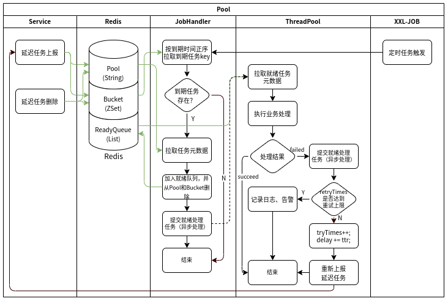

# 延迟队列

基于Redis(ZSet,List) & XXL-JOB 实现的延迟队列。

**设计方案参考**：https://tech.youzan.com/queuing_delay/

**在原方案基础上的优化**：

+ 使用 XXL-JOB 实现 Timer 功能
  + 可以复用 XXL-JOB 内部时间轮定时器
  + 可以借助 XXL-JOB 对任务进行方便的统一管理
  + 现采用单节点触发，同时只有一个节点执行任务，延迟队列中就绪子任务使用线程池异步处理
  + (TODO) 其实也可以使用 XXL-JOB 广播模式，Redis数据访问并发问题可以借助（Lua）脚本解决（避免任务重复执行），分片广播可以充分使用各节点服务器资源，加快任务处理速度
+ 添加延迟队列任务处理失败重试次数限制，避免异常任务长期驻留在内存

**工作流程**：

实现很简单，附一张流程图。

