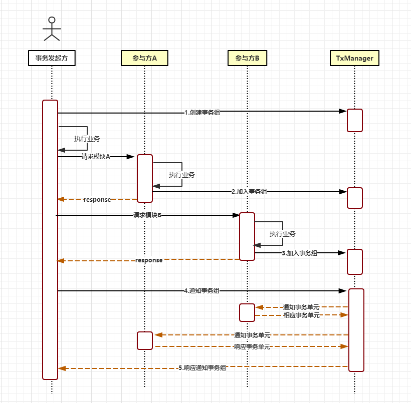
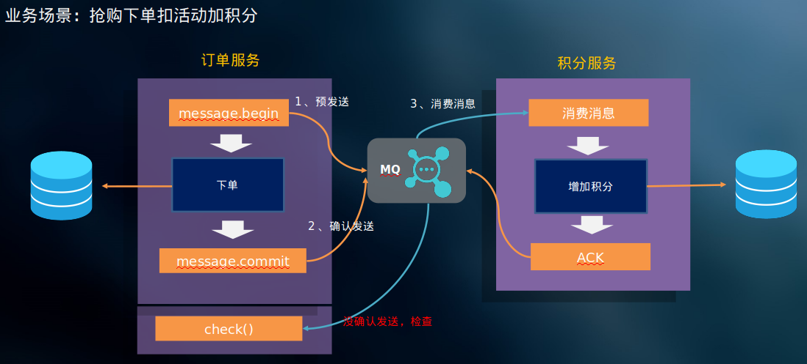

# 分布式事务

比如一个下单操作包含下单、加积分、减优惠券、生成出库单几个子操作，这几个子操作在不同的微服务进程中实现。

不依赖业内现有解决方案，自己独立实现的话应该怎么做？

**初始想法：**

需要有一个独立的线程监控这几个子操作的操作状态，当只有全部操作状态都为正常完成，才能算事务执行成功；否则则回退之前成功的子操作。

代码实现可以设计为观察者模式将监视器注册到各个微服务，然后依靠mq、redis发布订阅模式让各个子服务订阅监视器仲裁事务是否成功的信号（如果监视器宕掉，设置子服务获取仲裁信号超时则默认失败回退），其中使用唯一ID作为事务ID用于区分众多分布式事务，仲裁信号是成功的话则各个子操作完成退出，否则回退成功的子操作。

> 注意分布式事务又分为单数据源分布式事务（多线程单数据源）和多数据源分布式事务（单线程多数据源或者多线程多数据源[这种在大项目中居多]）。
> 而本地事务是针对单线程单数据源的（一旦涉及多个线程或多个数据源就成为了分布式事务）。

**业界方案：**

１）opengroup 制定了分布式事务的标准，即DTP(distributed transaction processing，分布式事务处理模型)；统一了事务操作，使不同的数据服务可以融合在一起并使用相同的接口实现事务统一管理。

２）

## 分布式事务处理模型 DTP


三个基本组件：

1) 应用程序(Application Program : AP): 定义事务边界(事务开始,结束)
2) 资源管理器 (Resource Manager: RM):任何用来存储数据的服务。
3) 事务管理器(Transaction Manager : TM): 监控事务进度,负责事务提交,回滚（TM既可以以jar包耦合到AP中[如：**atomikos**、**tcc**、**hmily** ... , 下面的图中的TM就是耦合的方式]，也可以设置成独立的服务[如：**seata**、**LCN**]）。

通信：

4) 通信资源管理器(Communcation Resource Manager : CRM)
5) 通信协议 (负责事务模型之间的通信协议)

> RM与TM之间定义了分布式事务接口规范：**XA** (定义事务注册、开始、回滚、结束的规则)。
> 很多数据服务都支持XA规范（即屏蔽底层事务操作的差异，使用同一套接口可以实现不同的数据服务的事务处理），如MySQL、RocketMQ等。

通过CRM使用通信协议连接多个DTP模型实例，组成DTP模型全局事务树。

以下单为例子下面每个AP可以理解为下单流程中的一个微服务（如订单服务、积分服务、优惠券服务、库存服务...）,每个微服务有自己的数据库（由RM管理）、TM, 经由CRM使用通信协议连接在一起，共同构成一个完整的分布式事务树。


## 一致性

+ 数据一致性

  + 强一致性

    又叫线性一致性，复制是同步的。

  + 弱一致性

    复制是异步的。

  + 最终一致性

    当用户从异步从库读取时，如果此异步从库落后，他可能会看到过时的信息。这种不一致只是一个暂时的状态——如果等待一段时间，从库最终会赶上并与主库保持一致。这称为最终一致性。

  + 读写一致性

    如果用户刷新页面，他们总会看到自己刚提交的任何更新。它不会对其他用户的写入做出承诺，其他用户的更新可能稍等才会看到，但它保证用户自己提交的数据能马上被自己看到。

+ 事务一致性

## 分布式事务模型

### XA接口规范

定义了RM和TM的交互接口，如事务注册、开始、回滚、结束等。

### 2PC(2阶段提交)处理模型

TM->RM1和TM->RM2都是实现方案已经实现的；不需要用户编码操作。

用户只需要在Application中调用XA接口执行事务提交操作，即commit。


2PC处理模型的问题：

+ 能确保prepare阶段，但不能确保commit阶段成功。

+ 数据库处理事务是同步阻塞的方式，比如发送prepare、commit命令，需要等待数据库返回操作状态。

  要是数据库无回复，应用会卡死在这里。

+ TM单点故障，还可能导致故障期间的事务直接中断（如果上一条commit刚执行完，第二条commit还没发出就故障，会导致数据不一致）。

+ 2PC有一个最大问题：使用同步阻塞，性能比较差，可能会导致服务器卡死。

但是上面问题很少发生，所以２PC还是被大量使用，各种解决方案针对２PC的问题还做了一些处理措施：如：**对对commit状态进行检查，commit异常做补偿**。

### 3PC(3阶段提交，性能差很少使用)

３PC在２PC的基础上做了两点改进：

１）引入超时机制，解决同步阻塞问题。在协调者（TM）和参与者(SM)中都引入超时机制。

​		事务超时不会阻塞下一个事务执行；但是如果是在doCommit的阶段超时，有些doCommit没有送达SM，有些送达或者超时，前者提交失败，后者提交或自动提交成功还是会出现数据不一致可能。

２）在第一阶段和第二阶段中插入一个准备阶段。保证了在最后提交阶段之前各参与节点的状态是一致的。
也就是说,除了引入超时机制之外,3PC把2PC的准备阶段再次一分为二,这样三阶段提交就有CanCommit、PreCommit、DoCommit三个阶段。


问题：

因为引入超时和链路变长性能更差。

## 分布式事务实现方案

### 耦合方式

#### 实现JTA规范

JTA(Java Transaction API): 满足XA规范的、用于Java开发的规范（即将XA规范中规定的DTP模型交互接口抽象成Java接口）。

某些web服务器（weblogic、jboss, 注意Tomcat未实现JTA规范）实现了JTA规范，也就是提供分布式事务支持，只需要通过JTA接口就可以实现业务分布式事务控制。

事务发起后，资源管理分别对各自管理的资源进行加锁，预操作；预操作成功之后将向事务管理器
申请协调，事务管理器发现所有资源管理器预操作都执行成功,就向资源管理器要求提交commit。

能确保prepare都执行成功，但是不能确保commit都执行成功。
所以还需要对commit状态进行检查，commit异常需要做补偿。
常见的事务产品都有做commit检查和补偿机制。

MySQL 从5.0.3开始支持XA分布式事务，且只有InnoDB存储引擎支持。

#### Tcc-Transaction

TCC事务机制相对于传统事务机制(X/Open XA Two-Phase-Commit),其特征在于它不依赖资源管理器(RM)对XA的支持,而是通过对(由业务系统提供的)业务逻辑的调度来实现分布式事务。

业务补偿机制：

主要由三步操作（需要程序员自己实现）:
Try: 尝试执行业务(1. 首先记录操作日志（事务id、组id），２.尝试执行业务)
Confirm:确认执行业务
Cancel: 取消执行业务。

特点:
该模式对代码的嵌入性高,要求每个业务需要写三种步骤的操作。
该模式对有无本地事务控制都可以支持使用面广。
数据一致性控制几乎完全由开发者控制,对业务开发难度要求高。

#### Atomikos

项目中使用到**多数据源（但是只适用于关系型数据库）**的时候大多数采用Atomikos解决分布式事务问题,Atomikos底层是基于XA协议的两阶段提交方案。

但是某些功能是收费的。

### 独立服务方式

#### LCN (发展趋势)

https://www.txlcn.org/zh-cn/



基于３阶段提交。

LCN的三种工作模式：

+ **LCN**

  疑问：

  ```java
  //为何在前端服务通过Feign调用分布式事务两个子操作，异常发生时LCN不生效？
  //而在ServiceA　save()方法中调用ServiceB的save()方法，异常发生时生效？
  @RequestMapping("/order")
  //不起作用（TODO:?）
  @Transactional
  @LcnTransaction()
  public String order() {
      serviceAClient.save();
      serviceBClient.save();
      return "done";
  }
  ```

  

+ **TXC**

+ **TCC**

> LCN、TXC只支持关系型数据库；针对多种类多数据源数据库应该使用TCC模式（普遍使用这一种模式）。

特点:  
该模式对代码的嵌入性较低。  
该模式仅限于本地存在连接对象且可通过连接对象控制事务的模块。  
该模式下的事务提交与回滚是由本地事务方控制，对于数据一致性上有较高的保障。  
该模式缺陷在于代理的连接需要随事务发起方一共释放连接，增加了连接占用的时间。  

#### SETA

#### MQ实现分布式事务

解决某些没有时效性的资源的事务。
RocketMQ内部已经实现了分布式事务。




## 分布式事务方案比较与选择


